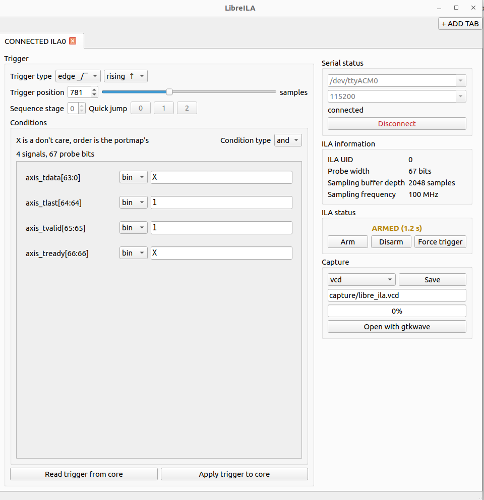
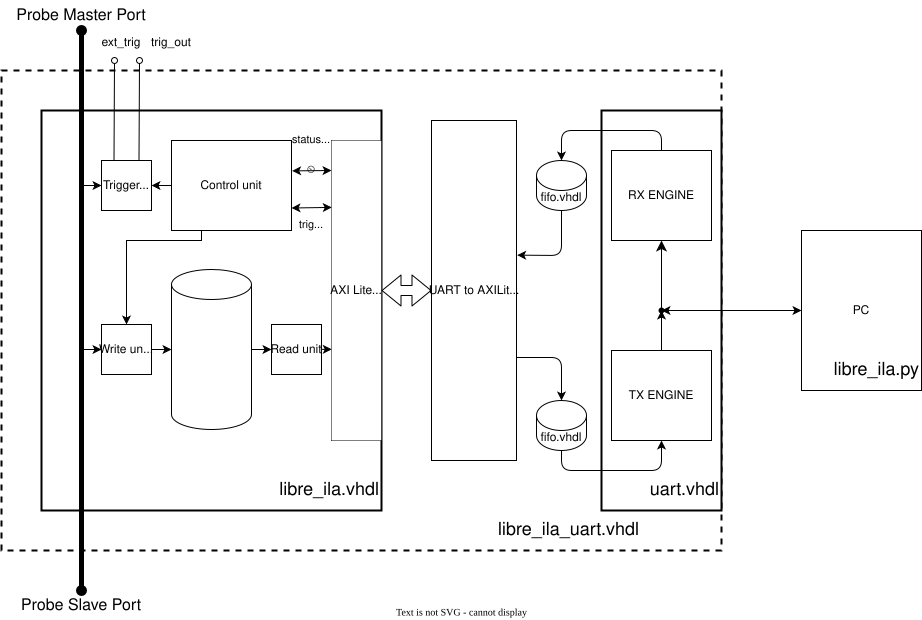

# LibreILA

    

An open source Integrated Logic Analyzer for FPGAs. Tap any signals in your fabric, trigger on a condition, and pull the capture back over UART as a `.vcd` you can open in GTKWave.

The ILA is a generic core, written in plain VHDL and the PC driver is written in python. The core can be used with any FPGA, and the driver can be used with any OS. But the C drivers are primarily written for the Microchip PolarFire SoC, from where the need of an ILA was felt.

    
     
    <em>Setting a trigger and arming the core from the python GUI</em>

The core samples one flat probe word and knows nothing about what those bits mean. The probe layout, and the signal names you get back in the `.vcd`, come from a `portmap.csv` you write.

    
     
    <em>Architecture diagram of the ILA core</em>

The LibreILA is successfully tested on hardware with Polarfire SoC Discovery Kit, triggered on actual stream and the project files are added in /tests/full/libre_ila_uart. Step by step instructions are added in manual in the docs. Note that, only single clock domain is currently tested, i.e., same clock for sampling and axilite interface.

## Features
* Generic probe: one flat probe word, the same layout is shared by the trigger vector and the sample buffer
* Optional external trigger port to synchronise with other ILAs
* Uses fabric ram for data storage and can be read back with AXI4Lite interface
* Data acquisition happens in a circular buffer, one sample per sampling clock edge while armed
* Probe taps are pass through, no delay is introduced due to the IP
* Customizable trigger:
    * Trigger can be set with AXI4Lite interface
    * Once setting the triggers condition, the ILA can be armed
    * Number of samples before and after trigger can be adjusted
    * The trigger condition can be taken on its level, its rising edge or its falling edge
    * Can also use an external trigger
    * A capture can be disarmed from either side of the trigger, so a condition that never fires costs a register write rather than a reset
* CDC on the ARM, DISARM and status bits
* Each core carries an instance ID, `G_UID`, read back at `0x14`, so a system holding several ILAs can tell which one it has reached
* A serial wrapper is also provided to easily use the ILA with the PC
* A C driver for the bare AXI4Lite core, and a python driver for the serial wrapper

# Documentation

> Note: Many of the docs are LLM generated, so they may contain errors. Please report any issues you find.

The datasheet is the specification. Everything else below is either a shorter
route to one part of it, or the thing it describes.

| Looking for | Go to |
|-------------|-------|
| How the core behaves and how to talk to it: probe and port structure, capture and trigger behaviour, clock domains, core parameters, the AXI4Lite register map register by register, and the UART packet format | [docs/datasheet.pdf](docs/datasheet.pdf) |
| The same register map, csv for ease of use, one row per field | [REGISTER_MAP.csv](REGISTER_MAP.csv) |
| Step-by-step usage manual | [docs/manual.pdf](docs/manual.pdf), work in progress |
| Generating a core for your own probe: the `portmap.csv` and `configuration.csv` formats, the `^^XX` directives, and why there is no `inout` | [codegen/README.md](codegen/README.md) |
| Driving the bare core from firmware over AXI4Lite | [drivers/baremetal/README.md](drivers/baremetal/README.md) |
| Driving the UART wrapper from a PC and dumping a `.vcd` | [drivers/python/README.md](drivers/python/README.md) |
| What each test covers and what it needs to run | [tests/README.md](tests/README.md) |
| The RTL itself | [hdl/libre_ila.vhdl](hdl/libre_ila.vhdl), wrapper in [hdl/libre_ila_uart.vhdl](hdl/libre_ila_uart.vhdl) |

The `.tex` sources for both documents are under [docs/tex/](docs/tex/); `make`
in that directory rebuilds the PDFs.

# Code generation
Since the core is generic, a build is fully described by two csv files in [codegen/](codegen/): `portmap.csv` and `configuration.csv`. See [codegen/README.md](codegen/README.md) for both formats, the `^^XX` directive table and how to run the generator.

# Tests
[tests/](tests/) is split by what a test needs to run rather than by what it covers:

* [tests/hdl/](tests/hdl/): GHDL simulations of the core and the wrapper, numbered in the order they build up in. These need ghdl and the generated core. `make sim-hdl`
* [tests/python/](tests/python/): host side tests for the python driver, no ghdl and no generated core, pyserial stubbed so nothing opens a port. `make sim-python`
* [tests/c/](tests/c/): the baremetal driver compiled and run on the host against a stubbed HAL, so it needs a C compiler and nothing from the PolarFire toolchain. `make sim-c`
* [tests/full/](tests/full/): the whole chain on real hardware, run from Libero and SoftConsole rather than from `make sim`. [tests/full/libre_ila_uart/](tests/full/libre_ila_uart/) holds the projects for the board build the capture at the top came from, with the configuration under test and the pass criterion in its own README. The bare core on AXI4Lite, and the cocotb simulation of the same chain, are still to come.

`make sim` runs all three, host side first because those take milliseconds. A directory counts as a test if it carries a Makefile with a `sim` target, so the numbering is a convention and not something the build depends on. See [tests/README.md](tests/README.md) for what each one covers.

# Drivers

* [drivers/baremetal/](drivers/baremetal/): C driver for the bare core over AXI4Lite. The probe is opaque to it, the whole register map is derived from the probe width, buffer depth and sampling clock frequency read back from the core.
* [drivers/python/](drivers/python/): python driver for the UART wrapper. `libre_ila.py` is the command line front end, `driver.py` speaks the register map and `vcd.py` turns the samples back into named signals, reading `portmap.csv` for the names and writing a `.vcd` any waveform viewer will open. `read_regs`/`write_regs` speak the UART packet format, splitting anything longer than 127 words across packets, and raise on a timeout or a mismatched response header. `gui.py` is the graphical front end shown at the top.

# Future improvements

### Cocotb end to end test (planned for v1.1)
A full system test using cocotb can be implemented to verify the HDL core and the driver together.

### Adding support for [surfer waveform viewer](https://surfer-project.org/) (planned for v1.2)
The surfer waveform viewer is a free and open source waveform viewer that can be used to view the captured data. 

### Chained trigger (planned for v2.0)
Chained trigger is using sequence of events to act as a trigger. This can be implemented to make ILA much more powerful.

### Data compression (unplanned)
This can be further optimised for the data storage compression although I don't prefer that as it will make the readout complex.

### Strided sampling (planned for v2.1)
Sampling every n th sample can be implemented to reduce the data storage requirements.

# Serving suggestions

VHDL Style Guide can be used to make the generated code more readable.

GHDL can be used to verify the generated code in the make itself.

## License

Copyright 2026 Yash Paritkar

Licensed under the CERN Open Hardware Licence Version 2 - Permissive
(`CERN-OHL-P-2.0`). See [LICENSE](LICENSE). Every source file carries its own
copyright and `SPDX-License-Identifier` header, so the licence travels with the
file when you copy the HDL into your own project.

Exception: [hdl/uart.vhdl](hdl/uart.vhdl) is derived from
[pabennett/uart](https://github.com/pabennett/uart), Copyright 2015 Peter
Bennett, licensed under Apache-2.0, and is modified here.
