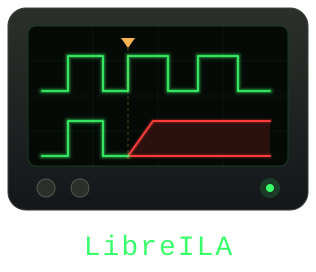

# LibreILA

This project contains work related to LibreILA (In-System Logic Analyzer).



The motivation to make this is follows:
* There is no ILA like in Xilinx toolchain in the Microchip toolchain, the SmartDebug can not replace the ILA
* ILA serves as a really good tool to debug the signals

The core itself is generic: it samples a single flat probe word of `G_PROBE_WIDTH` bits and knows nothing about what those bits mean. The build shipped in [hdl/libre_ila.vhdl](hdl/libre_ila.vhdl) wires that probe to a pass through 64-bit AXI4S pair (67 probe bits), which is the reference configuration used by the tests and the drivers. Any other probe port map is meant to be produced by the generator in [codegen/](codegen/) from a `portmap.csv`.

> The generator scripts in [codegen/](codegen/) are still work in progress, for now the probe concatenation is edited by hand in `w_probe`.

## License

This project is licensed under CERN Open Hardware Licence Version 2 - Permissive unless otherwise specified. See LICENSE for more details.

## Features
* Generic probe: one flat probe word, the same layout is shared by the trigger vector and the sample buffer
* Optional external trigger port to synchronise with other ILAs
* Uses fabric ram for data storage and can be read back with AXI4Lite interface
* Data acquisition happens in a circular buffer, one sample per sampling clock edge while armed
* Probe taps are pass through, no delay is introduced due to the IP
* Customizable trigger:
    * Trigger can be set with AXI4Lite interface
    * Once setting the triggers condition, the ILA can be armed
    * Number of samples before and after trigger can be adjusted
    * The trigger condition can be taken on its level, its rising edge or its falling edge
    * Can also use an external trigger
* CDC on the ARM and status bits
* A serial wrapper is also provided to easily use the ILA with the PC
* A C driver for the bare AXI4Lite core, and a python driver (work in progress) for the serial wrapper

# LibreILA core
This section contains information about the LibreILA core.

## The probe
The core samples one vector, `w_probe`, of `G_PROBE_WIDTH` bits. That concatenation in [hdl/libre_ila.vhdl](hdl/libre_ila.vhdl) is the single definition of the probe bit order; the sample buffer, the trigger vector and both drivers inherit it. Signals are packed LSB first, in the same order they are listed in `portmap.csv`.

For the stock AXI4S build the probe is:

| Bit range              | Signal |
|------------------------|--------|
| 63 downto 0            | TDATA  |
| 64                     | TLAST  |
| 65                     | TVALID |
| 66                     | TREADY |

To probe something else, edit `portmap.csv` and re-run the generator; it writes the ports, the `w_probe` concatenation and `G_PROBE_WIDTH` to match. Nothing else in the core has to be touched.

## Ports
The core is spliced into the link it probes, so the probe is a pair of
mirrored ports named after the role the core plays on each side, not after
the direction data happens to flow:

* `probe_slave_*`: faces the **master** of the probed link, so the core is
  the slave there. These ports carry the directions listed in
  `portmap.csv`.
* `probe_master_*`: faces the **slave** of the probed link, so the core is
  the master there. Every direction is the mirror of its `probe_slave_`
  twin.

For the stock AXI4S build that makes `probe_slave_axis_tvalid` an input and
`probe_slave_axis_tready` an output, exactly as an AXI4S slave would have
them, while `probe_master_axis_*` is the AXI4S master facing downstream.

* samp_aclk: sampling clock, the clock of the domain the probe lives in
* axil: AXI4Lite Slave port: Configuration and readout port
* i_ext_trig: external trigger port
* o_trig_out: internal trigger signal for chaining to other ILA instances

## Configuration Parameters
| Generic               | Description                                                  |
|-----------------------|--------------------------------------------------------------|
| G_SAMP_CLK_FREQ       | Sampling clock frequency in Hz, reported over AXI4Lite so the host can build the time axis |
| G_AXIL_CLK_FREQ       | AXI4Lite clock frequency in Hz                               |
| G_EXTERNAL_TRIG       | 1: use the external trigger pin instead of the trigger vector |
| G_PROBE_WIDTH         | Total probed bits, keep it a multiple of 32 for best results  |
| G_SAMP_BUFF_DEPTH     | Number of samples to store, must be a power of two            |
| C_S_AXIL_DATA_WIDTH   | AXI4Lite data width, do not change                            |
| C_S_AXIL_ADDR_WIDTH   | AXI4Lite address width, do not change                         |

`G_SAMP_BUFF_DEPTH` (power of two, greater than one) and `G_PROBE_WIDTH` (greater than zero) are checked with asserts at elaboration.

## axi4lite Register Map

32-bit registers; byte address = `Index * 4`. Sizing auto-scales with probe width and depth.

The map is laid out in three blocks: **output, then input, then the sample buffer.** The output block is a fixed eight registers whatever the core was synthesised with, so it goes first. Everything above it moves with the probe width, and the output block is what reports the probe width in the first place -- putting it last would mean a host had to know the probe width in order to find the register that tells it the probe width.

### Output (RO, index from the base address)

| Index | RW | Register Name       | Description                           |
|-------|----|---------------------|---------------------------------------|
|   0   | RO | Status              | ILA status register                   |
|   1   | RO | Magic key           | 0xb01dface                            |
|   2   | RO | Samp Clk Freqcy     | Sampling clock frequency (Hz), G_SAMP_CLK_FREQ |
|   3   | RO | Width               | G_PROBE_WIDTH, total probed bits      |
|   4   | RO | Buffer Depth        | G_SAMP_BUFF_DEPTH, sampling buffer depth |
|   5   | RO | Reserved            | Reserved                              |
|   6   | RO | samp_buff_trig_idx  | Index of the trigger sample           |
|   7   | RO | samp_buff_frst_idx  | Index of the first sample             |

Total output control registers: 8, always.

### Input (RW, index relative to the end of the output block, i.e. from index 8)

| Index  | RW | Register Name          | Description                 |
|--------|----|-------------------------|-----------------------------|
|   0    | RW | Trigger position        | Number of pre-trig samples  |
|   1    |  W | Arm_FT                  | Any write to this register arms the ILA or forces trigger if already armed |
|   2    | RW | Trigger configuration   | bit0: 0 = AND, 1 = OR; bit1: 0 = level, 1 = edge; bit2: 0 = rising, 1 = falling. See trigger vector section |
|   3    | RW | Reserved                | Reserved                    |
| 4      | RW | Trigger vector cond (LSB) | See trigger vector section |
| 4+a-1  | RW | Trigger vector cond (MSB) |                            |
| 4+a    | RW | Trigger vector mask (LSB) |                            |
| 4+2a-1 | RW | Trigger vector mask (MSB) |                            |

Here, `a` is `C_AXIL_STRIDE`: the same stride constant used to lay out the sample buffer (see below), i.e. the next power-of-two count of probe lanes (`C_N_LANES = ceil(G_PROBE_WIDTH/32)`), with a minimum of 4. This makes the trigger vector cond/mask registers share the exact same per-sample bit layout as the sample buffer.

Further input registers are auto added depending on the probe width. This block is the one that grows, which is why it sits between the two fixed-position blocks and not below them.

Total input registers: 4 + C_AXIL_STRIDE * 2

### Sample buffer (RO)

After this, sampling buffer is mapped with strides to ease the resource usage on the fabric. Each samp_buff is written as a bunch with number of registers used for each samp_buff as power of two to ease computation. For example, in the stock AXI4S build the bus is 64 bits wide and three signalling bits are probed alongside it, so the probe is 67 bits wide, needing 3 lanes, and the stride is rounded up to 4. Inside each stride, the data each stored in following format:

| Offset                | RW | Register Name                                     | Description                        |
|-----------------------|----|---------------------------------------------------|------------------------------------|
| 0                     | RO | samp_buff(31 downto 0)                            | The LSBs of the probe word         |
| 1                     | RO | samp_buff(63 downto 32)                           |                                    |
| C_N_LANES-1           | RO | samp_buff(G_PROBE_WIDTH-1 downto 32*(C_N_LANES-1))| The MSBs, zero padded              |
| C_N_LANES to stride-1 | RO | zero                                              | Padding up to the stride boundary  |

The probe word here is the same vector the trigger uses, so lane `n` holds probe bits `32n+31 downto 32n`. See the probe and trigger vector sections for the bit layout.

Total read only registers: 8 + C_AXIL_STRIDE * G_SAMP_BUFF_DEPTH

Total number of registers: 12 + C_AXIL_STRIDE * 2 + C_AXIL_STRIDE * G_SAMP_BUFF_DEPTH

The sample buffer base is the one address that still moves with the probe width, at `(8 + 4 + 2a) * 4` bytes. That is fine: by the time a host needs it, it has already read `Width` and `Buffer Depth` out of the fixed output block and can work `a` out for itself.

#### Status
This is the status register of the ILA. The ARMED, TRIGD and DONE signal bits are CDCed with 2FF to the AXI4Lite domain and hence suffer a slight delay. The internal status register does not have CDC and used for debugging.
| bit | Name   | Description                                  |
|-----|--------|----------------------------------------------|
|  0  | ARMED  | High if the ILA is armed                     |
|  1  | TRIGD  | High if the trigger happens                  |
|  2  | DONE   | Marks the completion of the ILA process      |
| 4-3 | STATUS | Internal status register of the ILA (No CDC) |

## Trigger vector
The trigger vector, condition and mask registers are merged into a single, unified per-bit vector that shares the exact same bit layout as one row of the output sample buffer (see the AXI4Lite register map and the output register section above): the probe word occupies the low bits, followed by reserved/padding bits up to the `C_AXIL_STRIDE`-register boundary.

| Bit range                              | Signal                           |
|----------------------------------------|----------------------------------|
| G_PROBE_WIDTH-1 downto 0               | The probe word                   |
| G_PROBE_WIDTH to (C_AXIL_STRIDE*32)-1  | Reserved (leave mask bit at '0') |

For every bit, the corresponding cond bit is the expected value of that signal and the corresponding mask bit enables that bit for the trigger check (`mask='1'` means the bit participates; `mask='0'` means it's ignored). A bit is considered "matching" when the live signal equals its cond bit.

The trigger configuration register (index 2, bit0) selects how the enabled bits are combined:
* `0` (AND): the ILA triggers only once **every** enabled bit is matching.
* `1` (OR): the ILA triggers as soon as **any** enabled bit is matching.

Since the whole probe word participates in the same per-bit vector, data bits can be combined with the signalling bits in either AND or OR mode -- there is no separate, single-bit "whole word matches" path for the data.

### Level and edge modes
The AND/OR reduction above produces a single condition bit. Bits 1 and 2 of the trigger configuration register decide what counts as a trigger on that bit:

| bit1 | bit2 | Mode    | Triggers when the reduced condition                |
|------|------|---------|----------------------------------------------------|
|  0   |  x   | Level   | **is** true                                        |
|  1   |  0   | Rising  | **becomes** true, having been false the sample before |
|  1   |  1   | Falling | **becomes** false, having been true the sample before |

Level is the default and the mode the register map has always had, so `0x0` keeps the pre-existing behaviour.

The distinction matters at arming time. In level mode, a condition that is already true when the ILA is armed triggers on the very first sample: "trigger when `tvalid` is high" on a mostly-idle stream fires immediately and captures nothing interesting. The edge modes wait for a transition instead. `trig_lvl_prev` is seeded with the live condition when the ILA is armed rather than cleared, so an already-true condition is not mistaken for a `0 -> 1` transition on the first sample.

Edge detection is applied to the reduced condition, not per probe bit -- it costs one flip-flop, since the whole probe word has already been reduced to one bit by then. There is no way to ask for "bit 5 rises **and** bit 9 falls in the same sample"; that would need a registered copy of the whole probe word and a second cond/mask vector. The reduced-condition edge is also what SUMP2 provides with its `AND Rising`/`OR Rising` trigger types.

The external trigger path (`G_EXTERNAL_TRIG = 1`) has always been rising-edge only and ignores all three bits.

## Trigger

### Arming and trigger position
A write to Arm_FT moves the ILA from IDLE to ARMED and capture starts. A second write while armed forces the trigger. The trigger position register holds the number of pre-trigger samples; the core keeps capturing for `G_SAMP_BUFF_DEPTH - trigger position - 1` samples after the trigger and then goes to DONE.

### External Trigger
The external trigger is a bit-wide input port. Use of external port needs to be enabled at the time of instantiation with `G_EXTERNAL_TRIG = 1`, and it replaces the trigger vector comparator: in that build the ILA triggers only on the rising edge of `i_ext_trig`, synchronised to the sampling clock domain. The resulting trigger is also driven out on `o_trig_out` for chaining.

## Output format
The output register can be seen in the above section. Internally, all the samples are stored in a LSRAM block, one 32-bit lane per `C_S_AXIL_DATA_WIDTH` slice of the probe word. The probe word is packed LSB first into lane 0 upwards and zero padded up to the lane boundary, so lane `n` carries probe bits `32n+31 downto 32n` and the last lane is zero padded in its upper bits. On readout the lanes are padded further, up to `C_AXIL_STRIDE` registers per sample, so that a sample index maps to an address with a shift instead of a multiply.

The AXI4Lite slave serves as read port for the RAM block. The offsetted read values are fed to the RAM port. This allows the design to make full use of the independent clock of the LSRAM of the PolarFire LSRAM block (Microchip document G238606).

## Clock domains
The core operates in the sampling clock domain, driven by `samp_aclk` and described to software by `G_SAMP_CLK_FREQ`. Feed it the clock the probed link runs on. The AXI4Lite is a separate domain, `G_AXIL_CLK_FREQ`.


# LibreILA UART Wrapper
This section contains information about the LibreILA UART Wrapper (libre_ila_uart.vhdl).

> Note that, it is assumed that the UART fifo are large enough that there is no overflow on the UART side.

The wrapper instantiates the core, so it carries the same generics, plus `G_UART_RX_FIFO_DEPTH`, `G_UART_TX_FIFO_DEPTH` and `BAUD_RATE`.

## UART packet format
The PC is the one managing the ILA. It is connected to the ILA with the UART interface. A custom packet format is defined to read/write the addresses. The packet format for the upstream and downstream is given below.

### PC to ILA WRAPPER
```text
| SYNC/VALID | R/W | #words | base address | Write Data Words |
|     0x55   | 0/1 | 7 bit  |   32-bits    | 32-bits x #words |
```

### ILA WRAPPER to PC
```text
| SYNC/VALID | valid | #words | base address | Read Data Words  |
|     0xAA   | 0/1   | 7 bit  |   32-bits    | 32-bits x #words |
```

### Wire details
The tables above show the fields, not the framing. What actually goes on the wire:

* **Every field wider than a byte goes MSB first**, both the base address and the data words. A 6 byte header, then `4 * #words` bytes of payload.
* **R/W and #words share one byte**: bit 7 is the R/W bit (`1` write, `0` read), bits 6 downto 0 are the word count. Same for the response byte, where bit 7 is `valid`.
* **#words is 7 bits, so one packet moves at most 127 words.** Longer transfers are split over several packets with the base address advancing by 4 per word. This is not an edge case: a full readout of the stock 2048 deep buffer at stride 4 is 8192 words, i.e. 65 packets.
* The base address is a **byte** address and must be 4 byte aligned. The core decodes `araddr(ADDR_LSB+OPT_MEM_ADDR_BITS downto ADDR_LSB)`, so the low two bits and anything above the register map are truncated rather than rejected: a misaligned or out of range address silently aliases onto a real register. Both drivers check alignment on the host side.
* **The response header is sent for a write as well as a read.** The wrapper emits it from `IUW_HDR` as soon as it has parsed the address, before the write data words have even arrived, so a writer that does not drain the 6 byte ack will desync the next transaction. Only a read is followed by data words.
* The `valid` bit in the response carries the wrapper's verdict on the request, see the sanity checks below. `0` means the request was refused and never reached the AXI bus.

`tests/python/00_pkt_format` pins all of this down against a model of the parser, and the `uart_ila_read`/`uart_ila_write` procedures in `tests/hdl/06_sim_libre_ila_uart/tb.vhdl` are the reference implementation of the PC side.

## Request sanity checks
The wrapper judges each request once the base address is in, latches the verdict for the whole packet and reports it in the `valid` bit of the response header. Two things are checked:

* **Address alignment.** The base address must have its low two bits clear. This matters because the core's decoder truncates rather than rejects: a misaligned write would land on a real register, and the second register of the input block is Arm_FT, so a stray write could arm the ILA or clobber the trigger configuration. A 2 bit compare is enough, since the transfer advances the address by 4 per word and cannot change those bits mid-packet.
* **RX FIFO overflow.** The uart writes into the RX FIFO unconditionally, so a byte handed over while the FIFO is full is gone and the packet is short from there on. The wrapper latches that instead of leaving it to surface as a bare watchdog timeout.

**A request that fails is answered but never put on the AXI bus.** The reply keeps the shape its header promised: a read returns the right number of zero words, and a write still has its payload drained from the FIFO. Draining matters, leaving those bytes behind would let the next `IUW_IDLE` mistake a data byte for a sync byte and act on the garbage packet behind it.

Two limits worth knowing:

* On a **write**, the header goes out before the data words arrive, so an overflow during the payload is reported on the *next* packet's header rather than the one it corrupted. The host sees a timeout followed by a `valid = 0`, which still says "bytes were dropped", just one transaction late.
* `o_nfull` lags a push by a cycle, so a byte dropped in that shadow is missed. Overflow detection is best effort: `valid = 0` means bytes were dropped, `valid = 1` does not promise none were.

**Range checking is deliberately left to the host.** In hardware it costs a comparator as wide as the address to buy what a driver works out for free from the probe width and buffer depth it already reads back. The python driver checks alignment before sending, so in normal operation the hardware check only ever fires for a buggy or foreign host.

## Clock domains
The core operates in the sampling clock domain, the AXI4Lite domain clock is kept separate. This block operates on the AXI4Lite clock. The UART clock is derived from the AXI4Lite clock.

## Watchdog timer
The wrapper has a watchdog timer to reset the wrapper in case of any error. The timer is incremented in non-IDLE mode and is reset when a byte is succefully is received via UART or AXI interface. A reset is issued when the timer reaches a certain value.

`WDT_TRIGGER` is `G_AXIL_CLK_FREQ` counts, i.e. one second without progress in a non-IDLE state. The reset drops the wrapper back to `IUW_IDLE` and abandons whatever it had parsed so far, so a half-received packet leaves no trace on the ILA side.

That makes the recovery contract on the host simple: **a timeout means the whole transaction is lost, never partially applied on the read side**, so the host should restart the transaction from its sync byte rather than try to resume mid packet. The python driver raises on both a timeout and a header that fails to match the request, and since `TimeoutError` is a subclass of `OSError`, a caller can cover both with one except clause and restart. Because `IUW_IDLE` discards every byte that is not `0x55`, the next sync byte resynchronises the link on its own.

# Code generation
Since the core is generic, a build is fully described by two csv files in [codegen/](codegen/):

* `portmap.csv`: the probed signals, one per line as `signal,width,type`, listed LSB first. This defines both probe ports, the `w_probe` concatenation and `G_PROBE_WIDTH`. The same file is read by the python driver to name the signals in the .vcd.
* `configuration.csv`: the generic values, one per line as `generic,type,value`.

`type` is the direction the signal has on `probe_slave_*`, i.e. the direction the probed link's slave would give it:

| type | Slave side | Master side | Pass through |
|------|------------|-------------|--------------|
| `in`  | input  | output | yes, slave to master |
| `out` | output | input  | yes, master to slave |
| `mon` | input  | none   | no, parallel tap only |

### Why there is no `inout`

A signal assignment cannot pass a bidirectional line through. `probe_master_x <= probe_slave_x` makes the core a *second driver* on the master side, so anything the far end drives resolves to `'X'`, and nothing ever propagates backwards. Writing both directions is a combinational loop. Even the open-drain idiom (`'0' when other = '0' else 'Z'`, both ways) latches up once both sides are low — real I2C repeaters avoid that with offset voltages, not logic.

It also isn't needed, because an ILA cannot sit between a pad and the outside world. Splice it on the fabric side of the IO buffer, where the bus is not bidirectional yet. A QPI flash, for example, is three unidirectional groups before the tristate:

```
qspi_sio_o,4,in     data the controller drives
qspi_sio_oe,1,in    turnaround control
qspi_sio_i,4,out    data read back
```

That captures strictly more than a pad probe would: drive value, enable and read value are separate, so the pad is reconstructable (`oe=1` controller driving, `oe=0` flash driving) and the turnaround itself becomes visible and triggerable — which is where the bugs usually are.

Where the bus genuinely cannot be spliced in series, for instance a controller that only exposes one bidirectional port, tap it in parallel with `mon`. The core reads the resolved value and never drives it.

`templates/` holds a starting point for both (`default_portmap.csv` is the stock AXI4S probe, `default_configuration.csv` the default generics). Both are read from `hdl/`, never written back to it, so the templates in `hdl/` stay the single source.

## Running it

```sh
python3 codegen/code_generator.py                        # stock build  -> codegen/gen_axis/
python3 codegen/code_generator.py \
        --portmap codegen/portmap.csv \
        --config  codegen/configuration.csv              # user build   -> codegen/gen/
python3 codegen/code_generator.py --dry-run              # report only, writes nothing
```

The output directory is picked automatically: a run with **both** csv files left at their shipped defaults is the stock build and lands in `gen_axis/`, anything else lands in `gen/`. `--outdir` overrides that. Neither directory is tracked.

`GEN_TYPE` decides which files come out: `0` emits the bare AXI4Lite core alone, `1` emits it together with the UART wrapper and the fifo/uart blocks it instantiates. The testbenches need the wrapper, so `templates/default_configuration.csv` keeps `GEN_TYPE` at 1.

The testbenches under `tests/hdl/` read `codegen/gen_axis/` rather than `hdl/`, so what gets simulated is what the generator actually emits. Each of those test Makefiles treats that directory as an order-only prerequisite: if it exists it is reused untouched, if it is missing the generator runs first. **After editing anything in `hdl/`, delete `codegen/gen_axis/` (or run `make clean`) or the tests will keep simulating the previous build.**

The generated files can be passed through VHDL Style Guide (VHDL Style Guide) to make them more readable.

> `configuration_generation.py` is still to be written, see the future improvements section.

## Code generation directives
The script works as find and replace. The lines with ^^XX are used as reference. Depending on the type of XX, different format are inserted. The generated block is inserted after the directive's comment header, i.e. after the run of comment lines that immediately follows the ^^XX line, so the heading and its closing rule stay above the generated code. See table for details:

| ^^XX | File | Description |
|------|------|-------------|
| ^^DI | both | Declaration of the probe ports, slave side |
| ^^DO | both | Declaration of the probe ports, master side |
| ^^MI | libre_ila_uart | Mapping of the slave ports in libre_ila_uart |
| ^^MO | libre_ila_uart | Mapping of the master ports in libre_ila_uart |
| ^^SH | libre_ila | Shorting of the probe master and slave ports |
| ^^MX | libre_ila | MUXING of the probe ports to the w_probe concatenation for writing into sampling buffer |

A directive listed for a file but never found in it aborts the run, so a silently dropped block cannot turn into an unconnected port at elaboration.

Alongside the directives the script rewrites the default of every generic named in `configuration.csv`, plus `G_PROBE_WIDTH` which it sums from the portmap. Only declarations that already carry a `:=` are touched, which confines this to the entity and leaves the wrapper's component declarations alone.


# Tests
[tests/](tests/) is split by what a test needs to run rather than by what it covers:

* [tests/hdl/](tests/hdl/): GHDL simulations of the core and the wrapper, numbered in the order they build up in. These need ghdl and the generated core. `make sim-hdl`
* [tests/python/](tests/python/): host side tests for the python driver, no ghdl and no generated core, pyserial stubbed so nothing opens a port. `make sim-python`
* [tests/c/](tests/c/): the baremetal driver compiled and run on the host against a stubbed HAL, so it needs a C compiler and nothing from the PolarFire toolchain. `make sim-c`

`make sim` runs all three, host side first because those take milliseconds. A directory counts as a test if it carries a Makefile with a `sim` target, so the numbering is a convention and not something the build depends on. See [tests/README.md](tests/README.md) for what each one covers.

# Drivers
* [drivers/baremetal/](drivers/baremetal/): C driver for the bare core over AXI4Lite. The probe is opaque to it, the whole register map is derived from the probe width, buffer depth and sampling clock frequency read back from the core.
* [drivers/python/](drivers/python/): python driver for the UART wrapper, reads the signal names from `portmap.csv` and dumps a .vcd. Work in progress. `read_regs`/`write_regs` speak the packet format above, splitting anything longer than 127 words across packets, and raise on a timeout or a mismatched response header.

# Future improvements

### Data compression
This can be further optimised for the data storage compression although I don't prefer that as it will make the readout complex.

### Finishing the generator script
The generator writes the probe port declarations, the shorting block, the `w_probe` concatenation and the default generics. One thing is still open:

* `i_ext_trig`/`o_trig_out` are always declared. `G_EXTERNAL_TRIG` only selects which trigger logic is generated inside, it does not remove the pins when they are unused.

### Generating the driver headers
`drivers/baremetal/core_libre_ila_regs.h` still wants `CORE_LIBRE_ILA_PROBE_WIDTH` and friends defined by hand per synthesis. The generator already computes all of it and could emit the header, and the per signal bit offsets it prints could feed the python driver's .vcd naming directly instead of it re-parsing `portmap.csv`.

### Masked data values
If needed, user can also modify the core to use masked data values for triggering.

# Serving suggestions

VHDL Style Guide can be used to make the generated code more readable.

GHDL can be used to verify the generated code in the make itself.